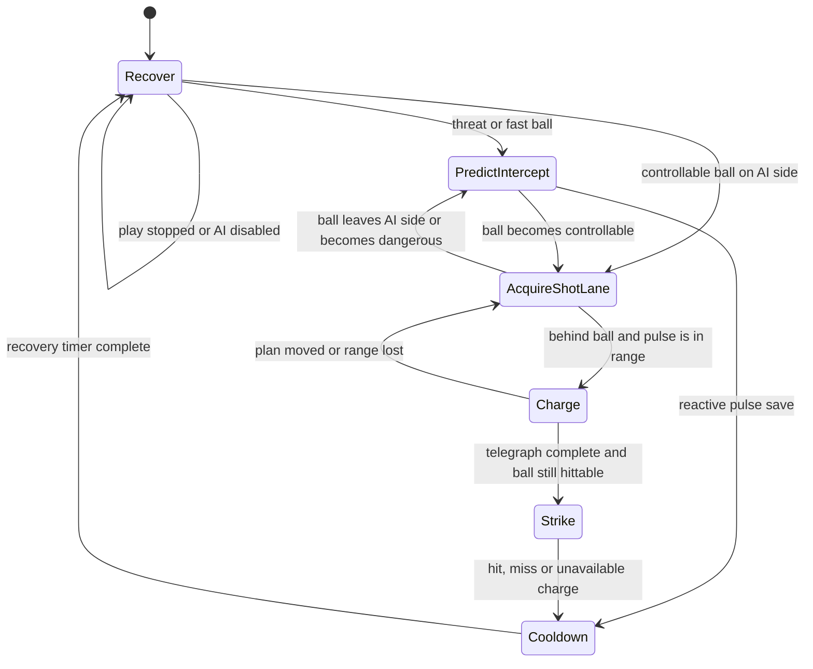
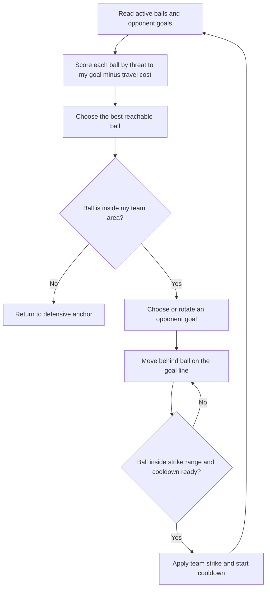

# Air Footy AI

**Original game:** Diego<br>
**AI and gameplay update:** JD<br>
**Revised:** 1 August 2026

I use two AI layers because the modes create different decision loads. Head-to-head play can spend more time constructing a readable shot. Four-team play needs a cheaper, faster threat response for multiple balls and opponents.

## Head-to-head state graph



## Head-to-head pseudocode

```text
EVERY PHYSICS STEP
    IF movement is disabled OR ball is missing
        stop planar movement
        RETURN

    update current state at the reaction interval
    update every step while charging, striking or cooling down
    move towards the state's target through the arena sweep solver
    finish an active dash when its time expires

STATE Recover
    move to the central defensive position
    IF the ball is active AND recovery time has passed
        IF ball is on the AI side AND is not a fast threat
            go to AcquireShotLane
        ELSE
            go to PredictIntercept

STATE PredictIntercept
    IF a fast ball is travelling towards the AI goal
       AND the ball is in pulse range
       AND a shared charge is available
        spend charge
        pulse through the same strike motor used by the player
        go to Cooldown

    reflect the ball's projected Z position across side-wall bounds
    defend that predicted lane

    IF the ball is slow, close, or no longer travelling at goal
        go to AcquireShotLane

STATE AcquireShotLane
    IF ball leaves the AI side
        go to PredictIntercept

    IF ball is pinned near a side or goal wall
        move inward and behind it until it releases
        RETURN

    IF there is no valid plan OR the ball moved too far
        build three candidates:
            near-post direct shot
            far-post direct shot
            side-wall bank shot using a mirrored goal point
        score each candidate by lane clearance, defender separation,
        reposition cost and controlled variety
        add deterministic aim error

    move to the contact point behind the ball
    optionally dash when the route is offensive, reachable and affordable

    IF contact position is close enough AND pulse can reach the ball
        go to Charge

STATE Charge
    hold the contact position and show the shot line
    IF ball or plan becomes invalid
        return to AcquireShotLane or PredictIntercept
    ELSE IF telegraph time is complete AND ball is in range
        go to Strike

STATE Strike
    spend one shared charge
    ask AirFootyStrikeMotor3D to pulse
    record the authoritative result
    go to Cooldown

STATE Cooldown
    return towards defence
    WHEN recovery time ends
        go to Recover
```

## Shot construction

For a direct shot, I aim from the ball to a point inside one goal post. I score the lane by its distance from the human defender, the separation between defender and target post, and the travel needed to reach the contact point.

For a bank shot, I mirror the goal point across the selected side wall. A straight line to that mirror gives the correct first-leg direction; the physical rail supplies the reflection. This keeps the plan inspectable and avoids a separate curved-ball rule.

Aim error is deterministic and bounded. Difficulty changes reaction delay, telegraph time and error, not restitution, mass or hidden force.

## Four-team decision flow



## Four-team pseudocode

```text
EVERY PHYSICS STEP
    IF disabled, eliminated, or no active ball exists
        stop
        RETURN

    FOR each active ball
        estimate how strongly it is travelling towards my home goal
        subtract the distance required to reach it
        ignore balls that are too deep in another team's area
    choose the highest-scoring ball

    IF no ball is safely reachable
        move to my defensive anchor
        RETURN

    choose an active opponent goal
    calculate attack direction from ball to that goal
    place target behind the ball, opposite attack direction
    move through the team-area semicircle solver

    IF distance to ball <= strike range AND cooldown is ready
        apply a deliberate team strike towards the selected goal
        rotate target goal for controlled variety
```

## Fairness and debugging checks

- Player and AI active contacts pass through `AirFootyStrikeMotor3D` and `BallController3D`.
- AI dash and pulse use the same shared charge-bank rules.
- The charge line is a visible commitment, not a decorative effect after the decision.
- Development telemetry records state transitions, shot types and strike results.
- Goals remain authoritative in `GoalZone3D` and `GameManager3D`; AI code cannot award score.
