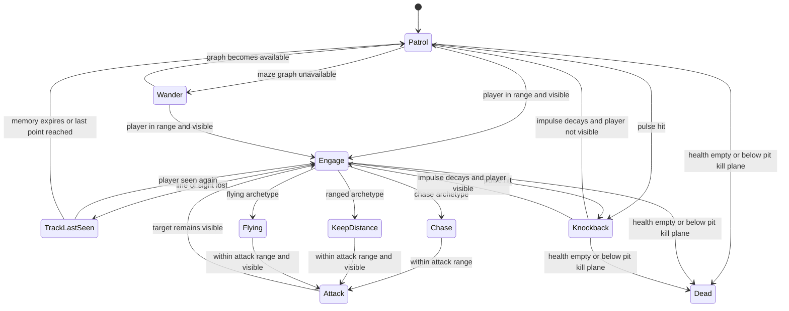

# Labyrinth Crawler enemy AI

**Maintainer:** JD<br>
**Revised:** 1 August 2026

The enemy controller is a small hierarchical state model implemented with clear conditional branches rather than a serialized state-machine asset. All archetypes share sight, memory, patrol and attack rules. Their locomotion mode changes what they do after confirming the player.

## State graph



`Engage` is the shared perception layer. `Chase`, `KeepDistance` and `Flying` are movement policies inside it, not separate awareness systems.

## Main pseudocode

```text
EVERY FRAME
    IF dead
        RETURN

    IF below pit kill plane
        apply lethal neutral damage
        RETURN

    IF stage is stopped OR upgrade screen is open
        RETURN

    IF knockback velocity is still meaningful
        move by knockback plus gravity when grounded
        decay knockback
        RETURN

    IF player cannot be found
        patrol using the maze graph
        RETURN

    eyePoint = authored eye OR feet + eye height
    targetPoint = player position + target height
    visible = distance <= detection range
              AND first blocking ray hit belongs to player

    IF NOT visible
        IF last sight is younger than tracking memory
            face and move to last known position
        ELSE
            patrol
        RETURN

    remember player position and current time
    clear old patrol target
    face player

    IF locomotion is Chase
        IF outside attack range
            move directly towards player
            RETURN
        stop moving
    ELSE
        move using ranged spacing and strafe policy
        IF locomotion is Flying
            adjust altitude for hover and upcoming obstacles

    IF inside attack range
        ask SpellCaster to cast slot zero with enemy faction and hit mask
```

## Patrol pseudocode

```text
IF maze graph is missing
    alternate between timed wander and pause phases
    turn away after side collisions
    RETURN

IF patrol pause has not ended
    stop
    RETURN

IF no waypoint exists
    find the nearest generated room
    collect graph neighbours whose doorway is open
    reject pit rooms
    raycast centre-to-centre so an illusory wall still blocks the route
    avoid immediately returning to the previous room when another choice exists
    choose one valid neighbour and add a small in-room offset

move towards waypoint
IF waypoint reached
    optionally pause and clear waypoint
IF grinding against a wall for more than 0.75 seconds
    abandon waypoint and re-plan
```

## Ranged and flying policies

```text
KEEP DISTANCE
    IF player is closer than minimum range
        retreat strongly and add a small strafe
    ELSE IF player is farther than attack range
        approach
    ELSE
        strafe left or right
    reverse strafe on a timer or side collision

FLYING HEIGHT
    start from cruise height plus a sine hover
    capsule-cast ahead at current height
    IF clear
        return towards cruise height after maneuver hold
    ELSE IF a low path clears the doorway
        duck to the safe low centre height
    ELSE IF a path above the obstacle clears
        climb above its bounds plus controller clearance
    keep the chosen height long enough to clear the obstacle
```

## Design constraints

- Patrol uses the generated room graph; it does not require a baked NavMesh.
- Illusory walls block patrol so enemies do not reveal secrets by walking through them.
- Pits are rejected for voluntary patrol, but chase can still cross one so the player can bait an enemy into falling.
- `SpellCaster` owns cooldown and spell rules. The enemy only supplies a cast context.
- Enemy prefabs own stable support components such as `AudioSource`, `HitFlash` and flyer wings.
