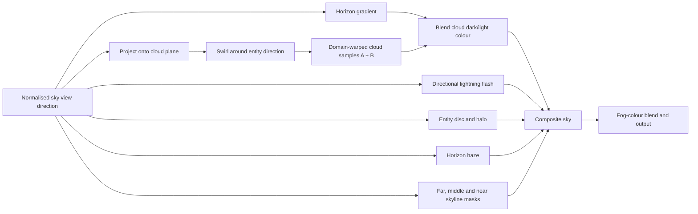
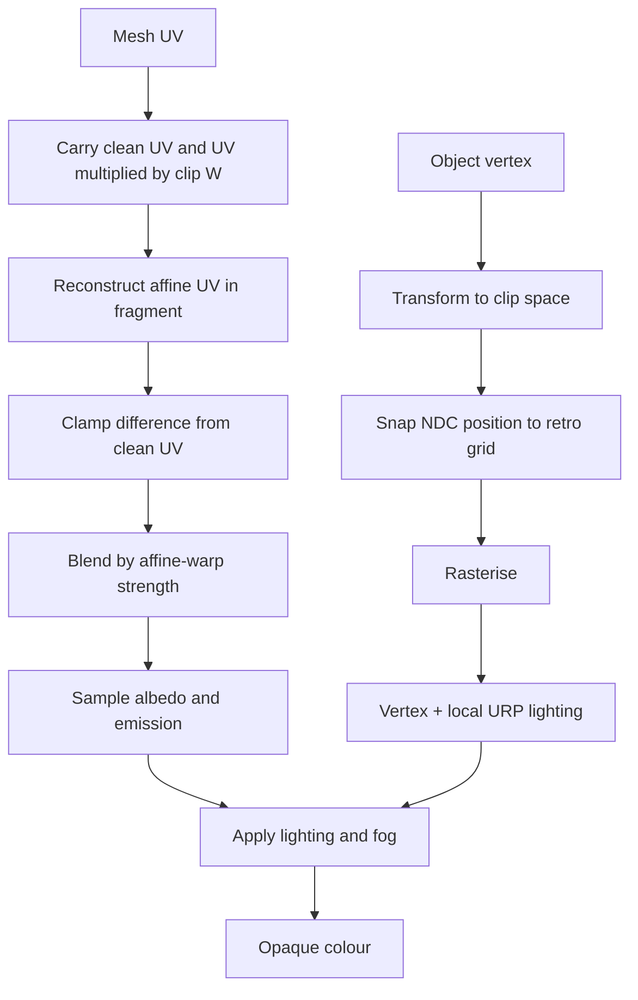
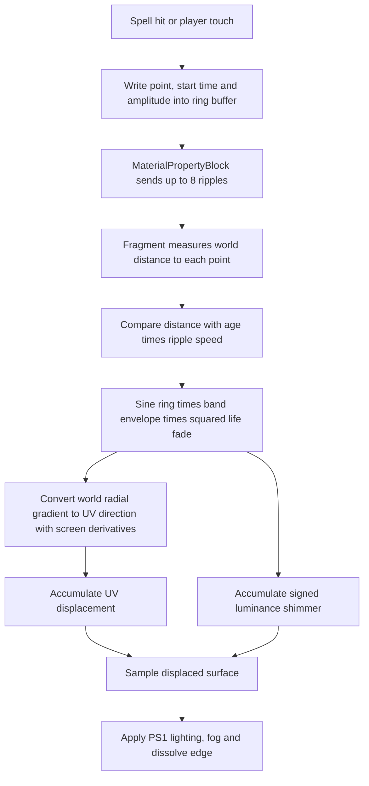

# Labyrinth Crawler shaders

**Maintainer:** JD<br>
**Revised:** 1 August 2026

I use three related shader paths: the storm sky builds the distant world, the PS1 lit shader makes maze surfaces unstable at low resolution, and the illusory-wall variant adds transient analytic ripples and a chunky dissolve.

## Storm sky



```text
STORM SKY FRAGMENT
    view = normalise(direction from camera through skybox vertex)
    entityDirection = direction from authored yaw and elevation

    cloudUV = view.xz / max(view.y, horizonBias) * cloudPlaneScale
    cloudUV = swirl cloudUV around projected entityDirection

    warp = sample cloud texture at low-frequency moving coordinates
    layerA = sample cloud texture at warpedUV * scaleA + time * speedA
    layerB = sample cloud texture at warpedUV * scaleB + time * speedB
    clouds = contrast(layerA * 0.68 + layerB * 0.32)

    baseSky = blend horizon colour to zenith colour by view height
    cloudColour = blend dark cloud to light cloud by cloud density
    colour = blend baseSky and cloudColour by coverage

    flashFacing = directional response between view and latest storm direction
    colour += flashColour * stormFlash * flashFacing

    entityMask, entityRadius = angular disc test(view, entityDirection)
    darken disc and add halo using entity presence/glow globals

    blend horizon haze
    composite far, middle and near skyline texture channels
    blend slightly towards the active fog colour
    OUTPUT colour
```

`StormDirector` supplies flash strength and direction. `RetroPresenter` owns the runtime sky material instance so a flash never dirties the authored material asset.

## PS1 lit surface



```text
VERTEX
    clip = objectToClip(vertex)
    ndc01 = clip.xy / clip.w * 0.5 + 0.5
    snapped = round(ndc01 * retroResolution) / retroResolution
    clip.xy = lerp(ndc01, snapped, snapStrength) converted back to clip space

    cleanUV = transformTextureUV(meshUV)
    affineCarrier = cleanUV * clip.w
    calculate vertex lighting and fog

FRAGMENT
    affineUV = affineCarrier / clip.w
    rawWarp = clamp(affineUV - cleanUV, -maxWarp, +maxWarp)
    finalUV = cleanUV + rawWarp * affineWarpStrength

    albedo = sample base map at finalUV * base colour
    lighting = vertex lighting + supported local lights
    colour = albedo * lighting + emission
    colour = apply fog
    OUTPUT opaque colour
```

The clamp matters on long floor and wall triangles. It keeps the deliberate texture swim without allowing a grazing surface to jump across most of its texture.

`RetroPresent.shader` then upscales the low-resolution render target, applies colour grading, a 4x4 Bayer dither, colour-level quantisation and a restrained vignette. That presentation pass stays separate from material lighting.

## Illusory-wall ripple

The ripple shader is `PS1IllusoryWall.shader`, driven by `IllusoryWall.cs`. It does not allocate a simulation texture. Each renderer receives up to eight world-space hit points, start times and amplitudes through a `MaterialPropertyBlock`.



```text
ON IMPACT OR TOUCH
    ripples[next] = (worldPoint, currentLevelTime, amplitude)
    next = (next + 1) modulo 8
    push arrays to each wall renderer through MaterialPropertyBlock

FOR EACH FRAGMENT
    rippleUV = 0
    shimmer = 0
    precompute UV and world-position screen derivatives

    FOR each of 8 ripple slots
        age = time - startTime
        IF amplitude is zero OR age is outside duration
            CONTINUE

        distance = world distance from impact to fragment
        front = age * rippleSpeed
        band = (distance - front) / wavelength
        envelope = saturate(1 - abs(band) * 0.5)
        life = square(1 - age / duration)
        wave = sin(band * fullTurn) * envelope * life * amplitude

        radialWorld = normalised impact-to-fragment direction
        radialUV = solve the local world-to-UV derivative system
        rippleUV += normalise(radialUV) * wave * rippleStrength
        shimmer += wave

    finalUV += rippleUV
    surfaceColour *= 1 + shimmer * shimmerStrength
```

The shimmer is signed and hue-free, so the wall reads like bent light rather than a magic-colour decal. The same shader uses world-cell noise for dissolve; cells clip as `_DissolveAmount` rises and a narrow emissive edge marks cells about to disappear.

## Tuning order

1. Set low-resolution target and snap strength.
2. Tune affine warp and its clamp on the longest floor triangle.
3. Tune fog and local lighting for combat readability.
4. Tune storm clouds, skyline and flash without changing exposure enough to hide enemies.
5. Tune ripple duration and strength last; it should reveal interaction without obscuring the wall texture.
